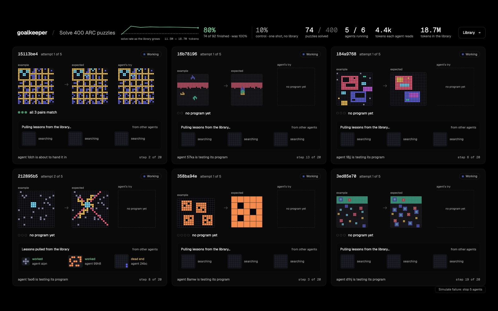
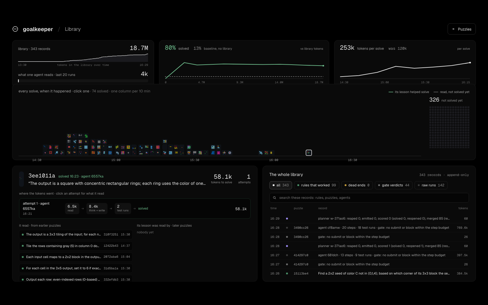

# goalkeeper

A runtime for long-running agent work. Workers keep no state, nothing can
change the goal once it is written, and any worker can die without losing
work. We built it in one day at the MongoDB Harness Engineering & Model
Wrangling Hackathon in New York on September 26, 2026, for problem
statement two, long-horizon engineering.

- Live dashboard: https://goalkeeper-gamma.vercel.app
- The library view: https://goalkeeper-gamma.vercel.app/library
- The architecture in one picture: [docs/architecture.html](docs/architecture.html)
  (open it in a browser)
- The pitch and the video script: [docs/PITCH.md](docs/PITCH.md)





## What we were trying to fix

If you have run an agent for a few hours you know the feeling. The
context fills up with old tool output and abandoned attempts. The goal
you wrote in the first message drifts out of view. Then the process
crashes, and the agent starts over with none of what it learned. Running
five agents in parallel gives you five copies of the same problem.

We wanted an agent system where the opposite happens: the longer it runs,
the better each next step gets. The trick we settled on is to keep
nothing inside the agent and everything in a database.

## How it works

There are two stores in MongoDB Atlas and one rule between them.

The **library** holds everything the swarm produces: every worker run,
every gate verdict, every planner turn, every error. We store the raw
record and never rewrite it. At ingest a cheap model adds a one-line
digest, entities and an embedding, so the record can be found later. It
grew from nothing to 18.7 million tokens during the afternoon, and no
worker ever reads it whole.

The **goal** is small. A human wrote it once at 14:23 (a statement, three
criteria with a deterministic check each, a few guidelines) and no code
path writes it after that. It is pinned into every request.

The rule: nothing moves from the library into the goal. Workers can learn
anything into the library. They cannot change their instructions.

A **worker** is a container that does one iteration and exits. It claims
a puzzle from the queue with one atomic update, assembles a context for
that puzzle (the goal, the rules already refuted on this puzzle, a digest
of what is failing across the fleet, and a few precedents pulled from the
library with `$rankFusion` over text, vector and recency, then reranked),
runs DeepSeek V4 Flash with three tools, and hands in a program. The gate
runs that program on the puzzle's example pairs. If it passes, the run
and the result go into the library, raw. If it fails, the refuted rule is
pinned into the next attempt. The context a worker reads stayed around
4k tokens all day.

The **planner** is a function, not a process. Before each claim a worker
checks whether the last planner turn is older than a minute, takes a lock
if it can, and runs one turn: requeue claims whose heartbeat stopped,
emit tasks for puzzles nobody has touched, score merged programs against
the hidden test answer, and reopen blocked puzzles once twenty more
solves have landed in the library. Queries only. No model calls.

Two things a worker never sees. The hidden test answer, which only the
planner's `score()` reads. And any other worker. They coordinate through
the library alone, the way ants coordinate through a trail.

## What happened today

We ran the 400 ARC-AGI-1 evaluation puzzles with DeepSeek V4 Flash and
thinking switched off. With thinking on it already solves about 90% of
them and there would be nothing to measure. Six workers on one VPS.

| | |
|---|---|
| Control: same model, one shot per puzzle, no tools, no library, 40 puzzles | 10% solved, 12.5% with two attempts |
| With the harness, of the puzzles it finished | 80% solved on the hidden test |
| Puzzles solved by 16:30 | 74 |
| Solves that came on a second or later attempt | 33 |
| Puzzles reopened by the hidden score with a hint | 11 |
| Puzzles reopened because the library had grown | 9 |
| Tokens a worker reads per request | about 4k |
| Library at 16:30 | 18.7M tokens, 343 records |
| Cost | under a dollar |

The control number matches what ARC Prize reports for this model without
thinking (12 to 13% on the semi-private set). We are not claiming a
benchmark result. The public evaluation set is probably in the training
data, so every number here is a best case. The claim is the gap between
the same model with and without the harness, measured the same way on
the same day.

## Run it

You need Node 24, an Atlas cluster, an OpenRouter key and a Voyage key.

```bash
cp .env.example .env
```

Fill in the keys, then install and create the indexes. The second
command creates the collections, the plain indexes, and the Atlas Search
and Vector Search indexes. Run it once per database.

```bash
npm install
```

```bash
npm run indexes
```

Seed the goal and the 400 puzzles. You can run this twice; the second run
changes nothing.

```bash
npm run seed -- --db live
```

Start a worker and watch it work. It claims a puzzle, pulls precedents,
writes a program, tests it with `try_submit` a few times, and hands it
in. Ctrl-C lets it finish the current iteration before it exits. For a
swarm, open more terminals and start more workers. There is no other
scaling step.

```bash
npm run worker
```

See where the run stands: tasks by status, solved versus wrong on the
hidden test, which workers are alive, library size, cost, and the last
few gate failures.

```bash
npm run status
```

Run the control. Same model, one call per puzzle, no tools, no library,
gated and scored like a worker. The dashboard reads the report and draws
it as the dashed line.

```bash
npm run baseline -- --n 40 --attempts 2
```

Run the dashboard on http://localhost:3000 against your own cluster.

```bash
npm run screen
```

## Things worth trying

Kill a worker while it is in the middle of a puzzle, with Ctrl-C twice or
with the "Simulate failure" button at the bottom of the stage view. Its
task stops heartbeating, the reaper requeues it within thirty seconds,
and the next idle worker picks it up with the attempt count raised and
the refuted rules from the first try already in its context.

Click any card on the stage view. Above the grids you see what that
worker was given before it wrote a line: programs from similar puzzles
written by workers it never met, and the dead ends from earlier attempts
on this puzzle.

Open the library view and click a solve on the timeline. The panel on
the left shows what that worker read before it solved its puzzle, and
which later solves read this one in turn.

Check that nobody cheated. This verifies that solved keys scored 1, that
no hint and no library record contains a test output, and that no merged
program hardcodes an example. We ran it every half hour.

```bash
npm run invariants
```

## Deploy the swarm

The workers run as a Dokploy Compose service built from this repo.

1. Create a Compose service with source GitHub, repository
   `imfabiokeller/goalkeeper`, branch `main`, compose path `compose.yaml`.
2. Paste the contents of `.env` as the environment. `WORKER_REPLICAS`
   sets the swarm size. Each worker gets 512 MB and the sandbox child is
   capped at 256 MB, so one worker plus one child fits.
3. Deploy. Redeploy after a push, or turn on auto deploy.

There is nothing to route and nothing to mount. The image ships `src/`
and `usecase/`, the workers only make outbound connections (Atlas,
OpenRouter, Voyage), each worker takes its id from its container
hostname, and its heartbeat in Atlas is the health check. To test the
reaper, stop a few containers from the Dokploy UI. To build the image
locally: `docker build -t goalkeeper-worker .`

The dashboard is `src/screen` in this repo, deployed on Vercel. It polls
Atlas, since Vercel functions cannot hold a change stream open.

## Layout

```
src/
  shared/    types.ts (Zod schemas, the contract), db.ts, llm.ts, indexes.ts
  gate/      gate.ts: runs the checks a task's criteria name
  context/   retrieve.ts ($rankFusion), assemble.ts, synthesize.ts
  worker/    loop.ts, claim.ts, run.ts (AI SDK tools), write.ts
  planner/   lock, reaper, emit, score, reopen, lessons, metrics, invariants
  seed/      lens to goal, inputs loader
  screen/    Next.js: stage, library, task
usecase/     ARC: lens.json, inputs, checks.ts, sandbox.ts, answers (score() only)
docs/        the plan, the design, the database contract, the pitch
```

## Docs

- [docs/PITCH.md](docs/PITCH.md): the pitch, the numbers, the video script.
- [docs/architecture.html](docs/architecture.html): the architecture as
  one picture.
- [docs/MVP.md](docs/MVP.md): the build plan and acceptance criteria. Wins
  over every other doc.
- [docs/DESIGN.md](docs/DESIGN.md): the architecture and the reasoning.
- [docs/DATABASE.md](docs/DATABASE.md): collections, indexes, the claim,
  the retrieval query.
- [docs/PLANNER.md](docs/PLANNER.md): the planner steps.
- [docs/GOAL.md](docs/GOAL.md): the goal document, version 1.
- [docs/USE-CASE.md](docs/USE-CASE.md): ARC, and what any use case must
  provide.
- [docs/QA.md](docs/QA.md): the judges' questions and the answers.
- [docs/PRIOR-ART.md](docs/PRIOR-ART.md): what exists and how this differs.
- [docs/SUBMISSION.md](docs/SUBMISSION.md): the submission text.

## Built during the event

Everything in `src/` and `usecase/`, between 10:30 and 17:00 on September
26, 2026: the worker loop (claim, heartbeat, context assembly, AI SDK tool
loop with `try_submit`, gate, write), the library (enrichment, `$rankFusion`
retrieval, rerank, briefing), the planner (reaper, emit, hidden scoring,
reopen, metrics, lessons digest), the ARC use case (fixture, sandbox,
checks, control script), the dashboard (stage, expanded card, task,
library) and the kill switch. We reused MongoDB Atlas, the Vercel AI SDK,
OpenRouter, Voyage, Next.js, Docker, and the ARC-AGI-1 data (Apache 2.0)
as they are.

License: Apache 2.0.
